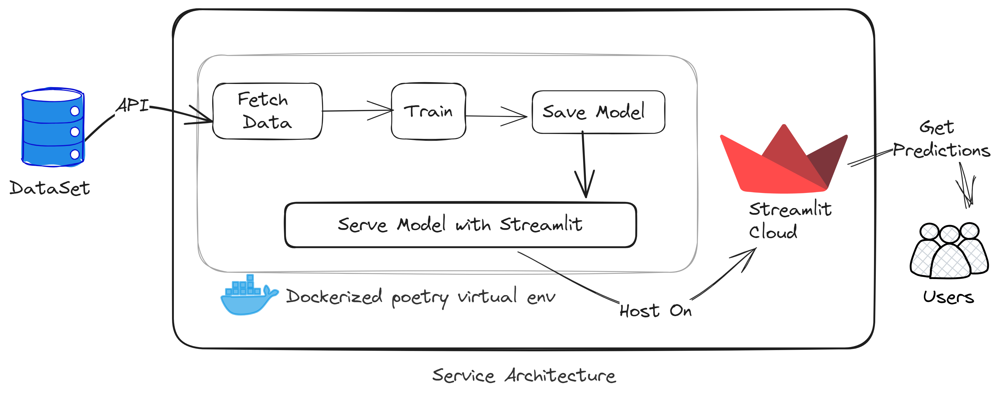

# Am I Diabetic 🩺
Am I diabetic? A machine learning approach for patient classification.

[Punch in some values here and know your status](#am-i-diabetic-🩺)
> The model should be used as a tool to assist healthcare professionals and not replace their expertise.

## Dataset 
[CDC Diabetes Health Indicators reference page](https://archive.ics.uci.edu/dataset/891/cdc+diabetes+health+indicators)

The Diabetes Health Indicators Dataset contains healthcare statistics and lifestyle survey information about people in general along with their diagnosis of diabetes. The 35 features consist of some demographics, lab test results, and answers to survey questions for each patient.

> Data is loaded direclty in code using the `ucimlrepo` module

## Problem Statement
The prevalence of diabetes is increasing globally, posing significant challenges to healthcare systems. Early detection and management of diabetes can lead to better health outcomes and reduce healthcare costs. However, identifying individuals at risk of developing diabetes or those who are pre-diabetic is a complex task due to the multifactorial nature of the disease.

The Diabetes Health Indicators Dataset provides a unique opportunity to explore this issue. It contains a wealth of information, including demographics, lab test results, and lifestyle survey responses from a diverse group of individuals. The dataset comprises 35 features for each patient and classifies them into three categories: diabetic, pre-diabetic, and healthy.

By accomplishing this task, we aim to contribute to the early detection and management of diabetes, ultimately improving patient outcomes and reducing the burden on healthcare systems.

## Objective
Develop a predictive model using the Diabetes Health Indicators Dataset to classify individuals into diabetic, pre-diabetic, and healthy categories.

## Architecture



## Install Instruction
Make sure you have [Conda/MiniConda](https://docs.conda.io/projects/miniconda/en/latest/index.html#quick-command-line-install) installed.
1. Setup virtual env 
	```bash
	conda create -n aid python=3.8 poetry
	```
2. Activate the env 
	```bash
	conda activate aid
	```
3. Install the dependency
	```bash
	poetry install --no-root --without dev
	```
## Acknowledgements
- TBD for Datset

## License
[MIT License](LICENSE)