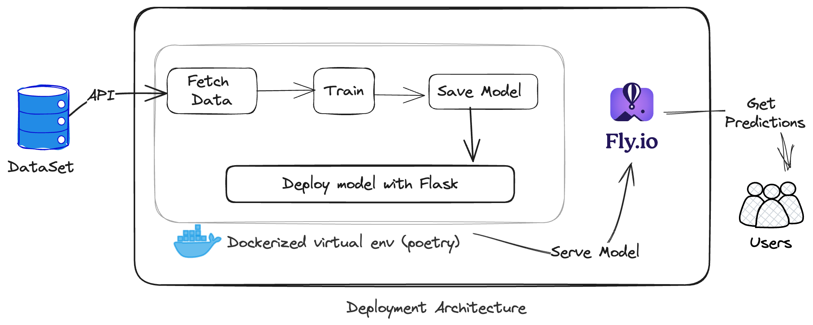

# Am I Diabetic 🩺


https://github.com/rkscodes/aid/assets/30290728/401317bc-5e5b-4421-bf93-900d26c99c57


Am I diabetic? A machine learning approach for patient classification.

> The model should be used as a tool to assist healthcare professionals and not replace their expertise.

## Dataset 
[CDC Diabetes Health Indicators reference page](https://archive.ics.uci.edu/dataset/891/cdc+diabetes+health+indicators)

The Diabetes Health Indicators Dataset contains healthcare statistics and lifestyle survey information about people in general along with their diagnosis of diabetes. The 35 features consist of some demographics, lab test results, and answers to survey questions for each patient.

Data is loaded direclty in code using the `ucimlrepo` module

## Problem Statement
1. The rising global prevalence of diabetes presents a significant challenge for healthcare systems, necessitating early detection and management to improve patient outcomes and reduce healthcare costs.

2. The Diabetes Health Indicators Dataset contains comprehensive information, including demographics, lab test results, and lifestyle survey responses, for a diverse group of individuals.

3. The primary objective is to develop a predictive model that accurately classifies individuals into one of two categories: diabetic or healthy.

4. Achieving this prediction will contribute to the early detection and management of diabetes, thereby improving patient outcomes and alleviating the burden on healthcare systems.

## Objective
Develop a predictive model using the Diabetes Health Indicators Dataset to classify individuals into diabetic and healthy category.

## Architecture



## Project Setup
To get started with this project, clone the repository to your local machine:
```bash
	git clone https://github.com/rkscodes/aid.git
	cd aid
```
Make sure you have [Conda/MiniConda](https://docs.conda.io/projects/miniconda/en/latest/index.html#quick-command-line-install) installed.
1. Setup virtual env 
	```bash
	conda create -n aid python=3.8 poetry
	```
2. Activate the env 
	```bash
	conda activate aid
	```
3. Install the dependency
	```bash
	poetry install --no-root --without dev
	```
4. To start jupyter notebook
	```bash
	jupyter notebook
	```

## Docker Setup
1. Make sure you are in root `aid/` containing `Dockerfile`.
2. Build Dockerfile Image
	```bash
	docker build -t predict_diabetes .
	```
3. Run Docker container
	```bash
	docker run -it --rm -p 6969:6969 predict_diabetes
	```
4. You can now now send `POST` request
	```bash
		curl -X POST \
		-H "Content-Type: application/json" \
		-d '{
			"highbp": "false",
			"highchol": "true",
			"cholcheck": "true",
			"bmi": 25,
			"smoker": "true",
			"stroke": "false",
			"heartdiseaseorattack": "false",
			"physactivity": "true",
			"fruits": "false",
			"veggies": "true",
			"hvyalcoholconsump": "false",
			"anyhealthcare": "true",
			"nodocbccost": "false",
			"genhlth": "good",
			"menthlth": 15,
			"physhlth": 3,
			"diffwalk": "true",
			"sex": "false",
			"age": "age_60_to_64",
			"education": "college_4_to_more",
			"income": "$50000_to_less_than_$75000"
		}' \
  		http://0.0.0.0:6969/predict
    ```

## Cloud Deployment Instruction
1. Make sure you are in root folder containing `fly.toml`.
2. Create an account on [`fly.io`](https://fly.io)
3. Make sure to activate your account by entering credit card details, you might be charged!
4. Install `flyctl` 
	```bash
	brew install flyctl
	```
5. Authorize `flyctl`
	```bash
	flyctl auth login
	```
6. To deploy run
	```bash
	flyctl deploy
	```
7. Hit the api with tool of your choice or using curl
	```bash
		curl -X POST \
		-H "Content-Type: application/json" \
		-d '{
			"highbp": "false",
			"highchol": "true",
			"cholcheck": "true",
			"bmi": 25,
			"smoker": "true",
			"stroke": "false",
			"heartdiseaseorattack": "false",
			"physactivity": "true",
			"fruits": "false",
			"veggies": "true",
			"hvyalcoholconsump": "false",
			"anyhealthcare": "true",
			"nodocbccost": "false",
			"genhlth": "good",
			"menthlth": 15,
			"physhlth": 3,
			"diffwalk": "true",
			"sex": "false",
			"age": "age_60_to_64",
			"education": "college_4_to_more",
			"income": "$50000_to_less_than_$75000"
		}' \
  		https://predict-diabetes.fly.dev/predict
    ```
## Acknowledgements
It it important to reiterate that I did not create this dataset, it is just a cleaned and consolidated dataset created from the BRFSS 2015 dataset already on Kaggle. That dataset can be found [here](https://www.kaggle.com/cdc/behavioral-risk-factor-surveillance-system) and the notebook used for the data cleaning can be found [here](https://www.kaggle.com/alexteboul/diabetes-health-indicators-dataset-notebook).

## License
[MIT License](LICENSE)
